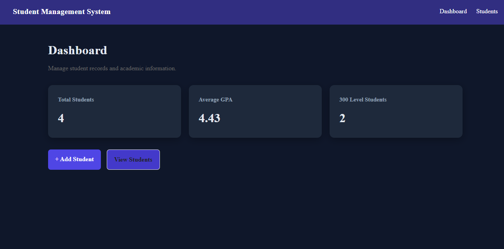
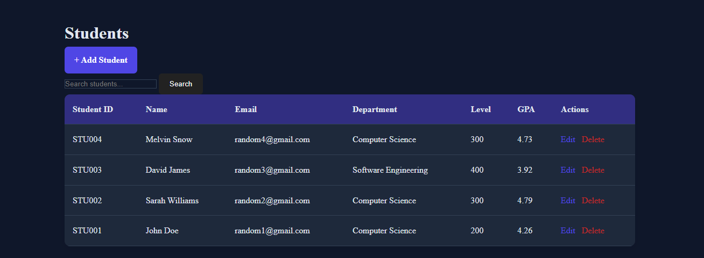
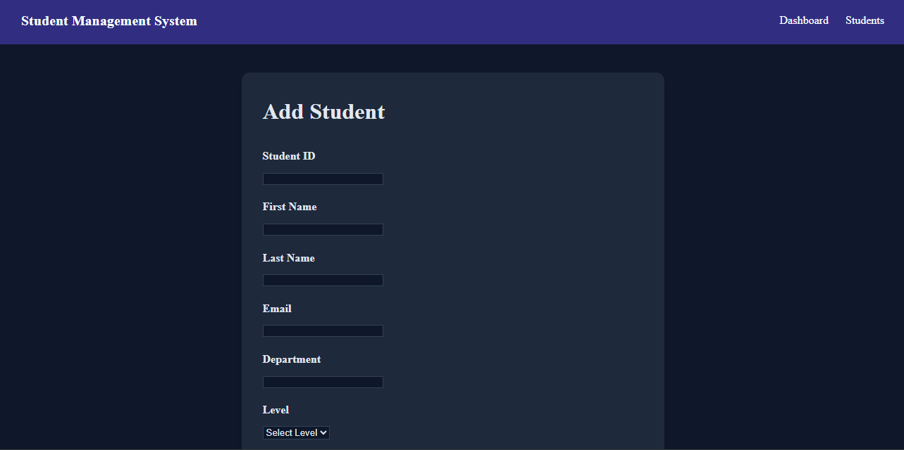
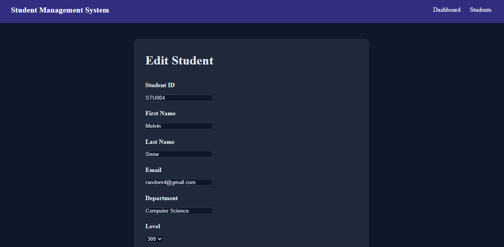

# Student Management System


A full-stack student management web application built with PHP and MySQL.


The application allows users to manage student records through a simple, responsive dashboard with CRUD functionality, search, validation, and database integration.


---


## 🚀 Features


- 📊 Dashboard with student statistics
- ➕ Add new students
- ✏️ Edit existing student records
- 🗑️ Delete student records
- 🔎 Search students
- 📋 View all registered students
- ✅ Server-side form validation
- 📧 Email validation
- 🎓 GPA validation
- 🔐 Prepared SQL statements
- 📱 Responsive design
- 🎨 Modern dark-themed UI
- 🗄️ MySQL database integration


---


## 🛠️ Technologies Used


- **PHP** — Backend development and application logic
- **MySQL** — Database management
- **HTML5** — Page structure
- **CSS3** — Styling and responsive design
- **Git & GitHub** — Version control and project management
- **XAMPP** — Local development environment


---


## 📂 Project Structure


```text
student-management-system/
│
├── config/
│   └── database.php
│
├── css/
│   └── style.css
│
├── .gitignore
├── index.php
├── students.php
├── add-student.php
├── edit-student.php
├── delete-student.php
└── README.md

Note: config/database.php contains local database credentials and is excluded from GitHub using .gitignore.

📸 Screenshots

Dashboard


Students

Add Student


Edit Student


💻 How to Run Locally
1. Install XAMPP

Install XAMPP and start:

Apache
MySQL
2. Clone the repository
git clone https://github.com/iwajomoamos student-management-system.git

Move the project into:

C:\xampp\htdocs\

3. Create the database

Open phpMyAdmin:

http://localhost/phpmyadmin

Create a database called:

student_management

4. Create the students table

Create a students table containing the fields required by the application, such as:

Field	            Type
id	                INT
student_id	        VARCHAR
first_name	        VARCHAR
last_name	        VARCHAR
email	            VARCHAR
department	        VARCHAR
level	            INT
gpa	                DECIMAL

5. Configure the database

Create or configure:

config/database.php

with your local MySQL credentials.

Example:

<?php


$host = "localhost";
$username = "root";
$password = "";
$database = "student_management";


$conn = new mysqli(
    $host,
    $username,
    $password,
    $database
);


if ($conn->connect_error) {
    die("Database connection failed: " . $conn->connect_error);
}

Do not upload your actual database credentials to GitHub.

6. Start the application

Open:

http://localhost/student-management-system/


🔎 Main Functionality

Dashboard

Provides an overview of the student database and quick access to the main features.

Student Management

Users can:

Add students
View students
Search students
Edit student information
Delete students
Validation

The application validates submitted information before storing it in the database.

🔐 Security

The project uses several basic security practices, including:

Prepared SQL statements
Server-side validation
Input validation
Email validation
GPA validation
Protected database configuration using .gitignore
🎯 What I Learned

This project helped me strengthen my understanding of:

PHP backend development
MySQL databases
CRUD operations
SQL queries
Prepared statements
Form handling
Server-side validation
HTML and CSS
Responsive web design
Git and GitHub


👨‍💻 Author
Amos Iwajomo

Computer Science student at Babcock University, Nigeria.

Interested in software development, web development, and building practical technology solutions.

GitHub: @iwajomoamos

Portfolio: iwajomoamos.github.io/portfolio

📄 License

This project was created for educational and portfolio purposes.


